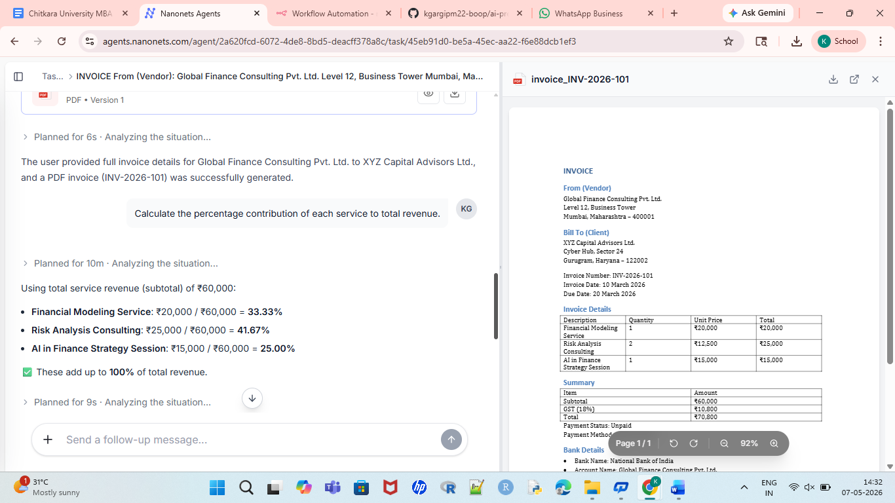
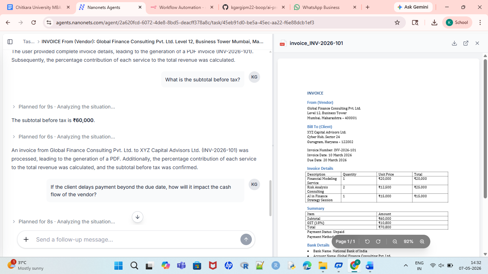
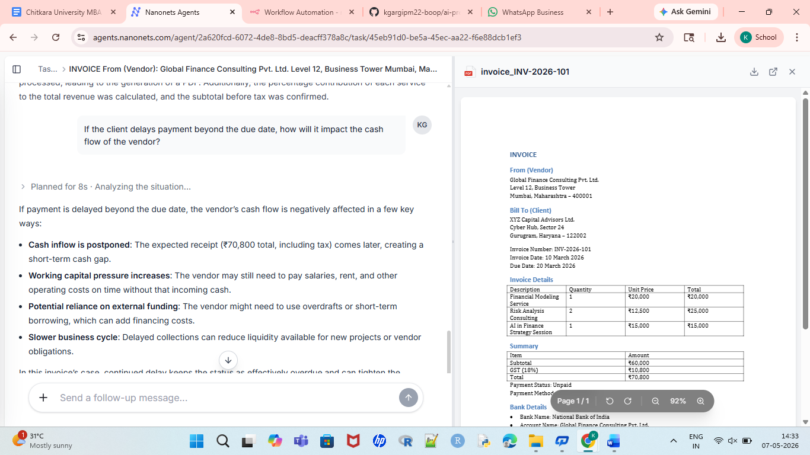

Invoice Data Extraction using Nanonets (No-Code AI)

🚀 Overview

This project demonstrates how to convert unstructured financial documents (invoices in PDF/image format) into structured, usable data using Nanonets, 
a no-code AI platform for intelligent document processing.

The lab showcases how AI-powered automation can replace manual data entry, reduce errors, and accelerate financial workflows—without
writing a single line of code.

🎯 Objective

To learn and demonstrate how AI systems can:

* Extract key financial fields from invoice documents automatically
* Convert unstructured PDFs into structured datasets (Excel/CSV)
* Validate extracted data against business rules
* Answer natural language questions about invoice content

🎯 Problem Statement

Traditional invoice processing faces significant challenges:

* Manual data entry is time-consuming and error-prone
* Unstructured formats (PDFs, scanned images) cannot be directly analyzed
* High volume processing creates bottlenecks in accounts payable
* Audit compliance requires accurate, traceable data extraction

The Scale of the Problem:
* 42 hours of manual work → 4 hours with AI
* ₹21,000 cost → ₹2,000 with automation

🏗️ Technology Architecture

| Step | Function | Technology | Outcome |
|------|----------|------------|---------|
| 1 | Input | File Processing | Document ready |
| 2 | OCR | Computer Vision (CNN) | Text extracted |
| 3 | Layout | Vision + NLP (LayoutLM) | Structure understood |
| 4 | Extraction | NLP/NER (BERT) | Fields identified |
| 5 | Tables | Table Detection Models | Line items extracted |
| 6 | Validation | Rule Engine | Data verified |
| 7 | Structuring | JSON/Database | Usable format |
| 8 | QA | Large Language Model | Answers generated |

🛠️ Tools & Technologies
* Nanonets – No-code AI document processing platform
* OCR Engine – Deep learning-based text extraction
* NLP Models – Named Entity Recognition for field extraction
* LayoutLM – Layout-aware document understanding
* LLM Integration – Natural language question answering

✅ Solution
One-click AI extraction workflow:

Upload invoice PDFs to Nanonets

AI auto-detects fields (invoice #, date, vendor, total)

Review highlighted extractions

Export structured data to Excel/CSV

Feed into Sheets/Power BI/ERP

Workflow: PDF Upload → Nanonets OCR → structured 

## 📸 Screenshots

### 1. Nanonets invoice with 1st question and answer

---

### 2. Nanonet with 2ND question and answer

### 3. Nanonet with 3RD question and answer

---

🏁 Conclusion
MBA Takeaway: This is Intelligent Document Processing (IDP)—the backbone of Digital Finance Transformation to extract the text from large files. 
Large enterprises use Nanonets to achieve analytics and 50% cost reduction.

👩‍💼 Author

Khushi Garg

MBA Finance Student | AI in Finance Practitioner
